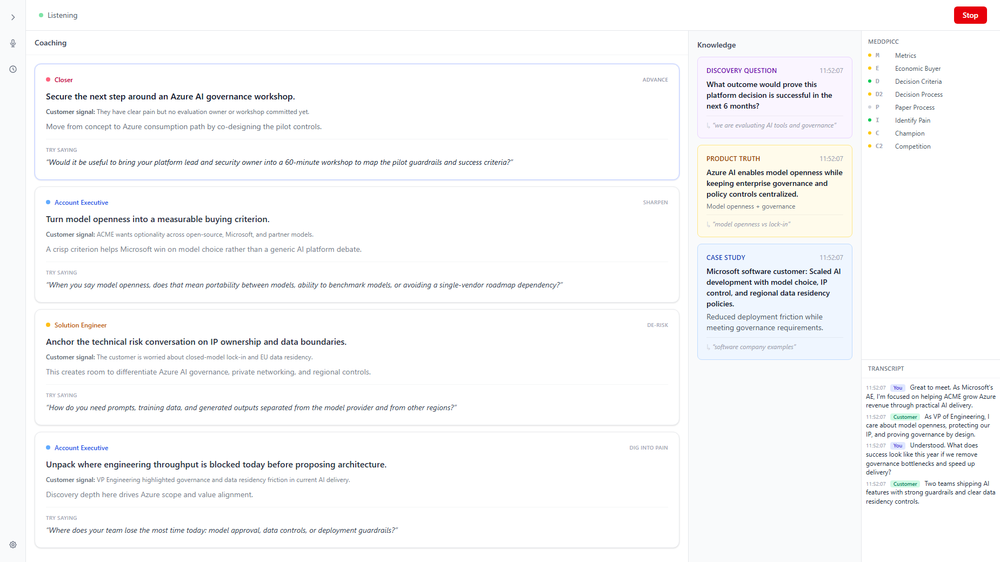
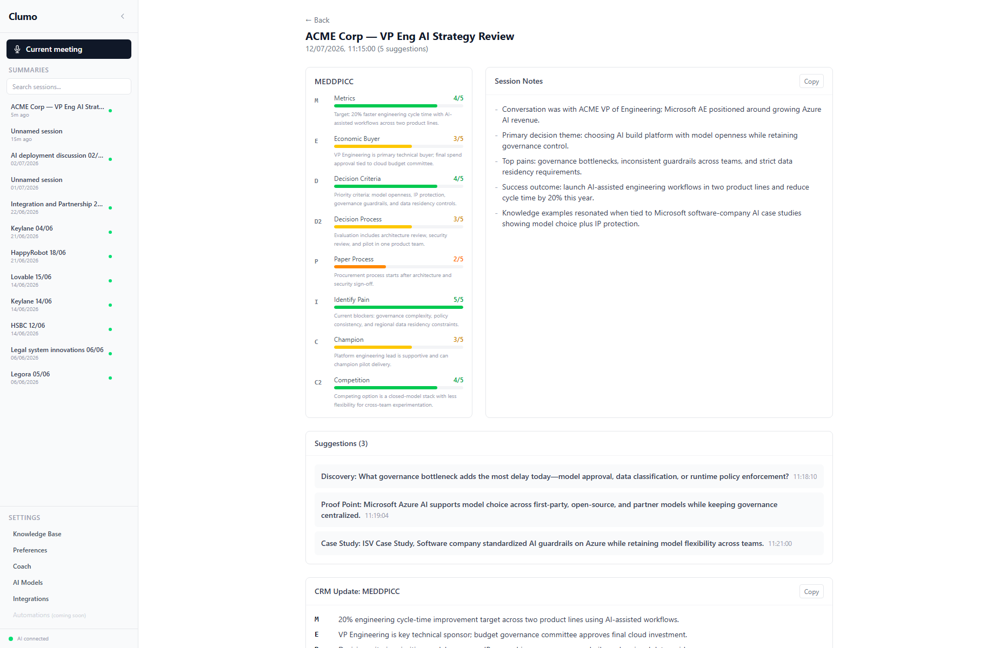

# Clumo

**AI-powered live call coaching for sales and technical sales teams.**

<p align="center">
  <a href="https://github.com/AJStaton/Clumo-OS/releases/latest/download/Clumo-Setup.exe">
    
  </a>
</p>

Clumo listens to your live sales calls and surfaces the perfect discovery question, case study, or proof point, exactly when you need it. In real-time. Not after the call. During it.

Ever left a customer call and thought "Damn, I wish I'd have said...", or missed the opportunity to ask the killer question? Or talk about the perfect case study? That's where Clumo helps. It's like having an A-player on every call with you.

Free, open source, stored data locally. Your knowledge base never leaves your machine. You bring your own AI keys.

<p align="center">
  
  <br>
  <em>Clumo realtime coaching and knowledge suggestions in call</em>
</p>

<p align="center">
  
  <br>
  <em>Post-call CRM follow ups and CRM integration</em>
</p>

---

## What it does

**Real-time AI coaching** — Suggestions streamed as you talk. Insights, discovery questions, case studies, and proof points surfaced at exactly the right moment based on what the prospect just said.

**Your private knowledge base** — Train Clumo with your website and docs. Your knowledge is stored locally on your machine, encrypted, and never shared.

**Sales framework tracking** — MEDDPICC or BANT tracked in real-time as the conversation progresses. See qualification gaps live, not in a post-call review.

**Bring your own keys** — Works with Azure OpenAI or OpenAI. Your keys, your data, your costs. Keys are encrypted at rest. No middleman, no data sharing, no telemetry.

**Post-call analysis** — Automatic call notes, automate CRM updates, and follow-up emails generated from the full conversation context.

**Desktop app** — Works with any meeting platform — Zoom, Teams, Meet, or anything running on your machine. No browser extension. No Docker. Just download and run.

---

## Who it's for

**Account Executives** — Discovery questions suggested in real-time. Qualification frameworks tracked automatically. Stop taking notes and start closing deals — Clumo remembers everything so you can focus on the relationship.

**Technical Sales / SEs** — You're running live demos and deep technical conversations where one perfectly-timed case study can change the outcome. Clumo listens to the context and surfaces exactly the right asset from your knowledge base. Never get caught without the proof point when a prospect pushes back.

**Founder-led sales** - You've built the product, but running sales calls is a completely different skill. Keep yourself on track with coaching from an A-player sales person. 

---

## Quick start

Up and running in 5 minutes.

### 1. Download

Download the latest release for your platform from [GitHub Releases](../../releases):


### 2. Paste your API key

Open Clumo. Select your AI provider (Azure OpenAI or OpenAI), paste your API key, and click **Test Connection**.

See [API Key Setup](#api-key-setup) below for step-by-step instructions on getting your keys.

### 3. Train with your website

Enter your company website URL and/or upload sales documents (PDFs, DOCX, markdown). Clumo will automatically extract case studies, discovery questions, and proof points to build your knowledge base.

### 4. Start coaching

Select your audio source (Zoom, Teams, or any app), click **Start Listening**, and run your call. Clumo handles the rest.

---

## How it works

Clumo uses a two-stage suggestion engine:

1. **Knowledge retrieval** - As the conversation is transcribed in real-time, Clumo converts transcript chunks into embedding vectors and compares them against pre-computed embeddings for every knowledge base item using cosine similarity. Items above a similarity threshold become candidates. This scales cleanly to hundreds of knowledge items without the false-positive issues of keyword matching.

2. **AI Coaching** - Strategic insight and killer questions to guide the conversation in the right direction. Where knowledge is the 'killer bit of information', AI coaching is the A-player sat next to you telling you where to focus next. 

### Audio capture

The desktop app uses Electron's `desktopCapturer` API to capture audio from any application on your system — Zoom desktop, Teams, Google Meet, or any softphone. Audio is converted to PCM16 at 24kHz and sent to the Realtime API for transcription.

On **Windows**, system audio capture works natively. 

### MEDDPICC tracking

Clumo continuously analyzes the transcript for evidence of MEDDPICC qualification criteria (Metrics, Economic Buyer, Decision Criteria, Decision Process, Paper Process, Identified Pain, Champion, Competition). The tracker updates live during the call, showing which criteria have been confirmed, partially addressed, or not yet found.

---

## Architecture

```
┌─────────────────────────────────────────────────────┐
│                 Clumo Desktop App                    │
│                                                     │
│  ┌─────────────────────────────────────────────┐   │
│  │            React UI                          │   │
│  │  Call · Sessions · Knowledge Base · Settings │   │
│  └──────────────────┬──────────────────────────┘   │
│                      │                              │
│  ┌──────────────────▼──────────────────────────┐   │
│  │            Node.js Server                    │   │
│  │  Suggestion Engine · KB · SQLite · Storage   │   │
│  └──────────────────┬──────────────────────────┘   │
│                      │                              │
│  ┌──────────────────▼──────────────────────────┐   │
│  │         Electron desktopCapturer             │   │
│  │  System audio / window audio / microphone    │   │
│  └─────────────────────────────────────────────┘   │
│                                                     │
└──────────────────────┬──────────────────────────────┘
                       │
                ┌──────▼───────┐
                │  AOAI / OAI  │
                │ (your keys)  │
                └──────────────┘
```

The Electron app bundles everything into a single installable application:
- The **Node.js server** runs as a background process (invisible to the user)
- The **React UI** is served by the embedded server
- **desktopCapturer** provides native audio capture from any application
- **SQLite** stores config and session metadata
- **Local filesystem** stores knowledge bases and full session data

All data stays on your machine. The only external connection is to the AI provider you configure (Azure OpenAI or OpenAI) for transcription and suggestion scoring.

---

## Project structure

```
clumo/
├── server/                           # Node.js backend
│   ├── index.js                      # Express + WebSocket server
│   ├── routes/
│   │   ├── api.js                    # REST API (sessions, KB, settings, onboarding)
│   │   └── ws.js                     # WebSocket (audio relay, transcription, suggestions)
│   ├── suggestion-engine.js          # Two-stage matching + MEDDPICC tracking
│   ├── knowledge-base.js             # Default KB + loader
│   ├── knowledge-generator.js        # Onboarding pipeline (scrape + parse + generate)
│   ├── ai-provider.js                # BYOK abstraction (Azure OpenAI / OpenAI)
│   ├── db.js                         # SQLite database
│   ├── storage.js                    # Local filesystem storage
│   ├── document-parser.js            # PDF, DOCX, markdown parser
│   ├── hybrid-website-scraper.js     # Website scraper with LLM extraction
│   └── data/                         # SQLite DB, KBs, sessions (gitignored)
│
├── web/                              # React frontend
│   ├── src/
│   │   ├── pages/
│   │   │   ├── Call.jsx              # Live coaching (transcript + suggestions + MEDDPICC)
│   │   │   ├── Sessions.jsx          # Session history
│   │   │   ├── Session.jsx           # Session detail + post-call analysis
│   │   │   ├── Setup.jsx             # First-run wizard
│   │   │   ├── KB.jsx                # Knowledge base management
│   │   │   └── Settings.jsx          # API keys and preferences
│   │   ├── components/
│   │   │   ├── SuggestionCard.jsx    # Suggestion card with auto-dismiss
│   │   │   ├── Transcript.jsx        # Live scrolling transcript
│   │   │   ├── MeddpiccTracker.jsx   # MEDDPICC progress bars
│   │   │   └── AudioSourcePicker.jsx # Audio source selector
│   │   └── lib/
│   │       └── ws-client.js          # WebSocket client
│   └── vite.config.js
│
├── electron/                         # Desktop app wrapper
│   ├── main.js                       # Electron main process
│   ├── preload.js                    # Secure bridge (desktopCapturer, server port)
│   └── server-manager.js             # Spawns and manages the embedded server
│
└── docs/
```

---

## API key setup

Clumo requires an AI provider for real-time transcription (Realtime API) and suggestion scoring (Chat API). You bring your own keys — Clumo never stores or transmits them anywhere except directly to your chosen provider.

### Option A: Azure OpenAI

1. Create an Azure OpenAI resource in the [Azure Portal](https://portal.azure.com)
2. Deploy three models:
   - A **chat** model (e.g. `gpt-4o` or `gpt-4o-mini`) — used for suggestions
   - A **realtime** model (`gpt-4o-realtime-preview`) — used for transcription
   - An **embedding** model (`text-embedding-3-small`) — used for semantic matching
3. In Clumo's setup wizard, enter:
   - **Endpoint**: `https://your-resource.openai.azure.com`
   - **API Key**: from the Azure Portal
   - **Chat deployment name**: whatever you named your chat model
   - **Realtime deployment name**: whatever you named your realtime model
   - **Embedding deployment name**: whatever you named your embedding model

### Option B: OpenAI

1. Go to [platform.openai.com/api-keys](https://platform.openai.com/api-keys)
2. Create a new API key
3. Ensure your account has access to:
   - A **chat** model (e.g. `gpt-4o` or `gpt-4o-mini`) — used for suggestions
   - A **realtime** model (`gpt-4o-realtime-preview`) — used for transcription
   - An **embedding** model (`text-embedding-3-small`) — used for semantic matching
4. Paste the key into Clumo's setup wizard


### Cost estimates

The primary cost is the Realtime API for transcription. Rough estimates:

| Call duration | Estimated cost |
|--------------|----------------|
| 15 minutes | $0.25 - $0.50 |
| 30 minutes | $0.50 - $1.00 |
| 60 minutes | $1.00 - $2.00 |


Costs depend on your provider's pricing, which model you use, and how much audio is processed. Check [OpenAI pricing](https://openai.com/pricing) or [Azure OpenAI pricing](https://azure.microsoft.com/pricing/details/cognitive-services/openai-service/) for current rates.

---

## Development

### Prerequisites

- Node.js 18+
- npm 9+

### Dev mode

```bash
git clone https://github.com/yourorg/clumo.git
cd clumo

# Install all dependencies
npm install

# Run server + Vite dev server (hot reload)
npm run dev
```

Open `http://localhost:5173` in your browser. Changes to React components update instantly.

The Vite dev server proxies API calls to the Express server on port 3000, so the full app works in a browser during development.

### Testing in Electron

```bash
# Build the web UI
cd web && npm run build

# Run the Electron app
cd ../electron && npm start
```

Add `--dev` to open DevTools: `npm start -- --dev`

### Building installers

```bash
# Build the web UI first
cd web && npm run build

# Build platform installers
cd ../electron && npm run build
```

Output appears in `dist/`:
- **Windows**: `Clumo Setup.exe` (installer) + `Clumo.exe` (portable)
- **macOS**: `Clumo.dmg`
- **Linux**: `Clumo.AppImage` + `Clumo.deb`

---

## Tech stack

| Component | Technology |
|-----------|-----------|
| Desktop app | Electron |
| Frontend | React, Vite, Tailwind CSS |
| Backend | Node.js, Express, WebSocket (ws) |
| Database | SQLite (better-sqlite3) |
| AI | OpenAI / Azure OpenAI (gpt-4o, gpt-4o-realtime-preview, text-embedding-3-small) |
| Audio | Electron desktopCapturer, Web Audio API, PCM16 encoding |
| Transcription | OpenAI Realtime API (Whisper) |
| Document parsing | officeparser (PDF, DOCX), cheerio (HTML) |

---

## Security and privacy

### How Clumo handles your API keys

Your API keys are encrypted the moment they're saved using **AES-256-CBC**, the same encryption standard used by banks and government systems. Each encryption operation uses a unique random initialization vector (IV), so even the same key encrypted twice produces completely different ciphertext.

- A 256 bit encryption key is generated automatically on first run and stored locally on your machine
- Encrypted keys are stored in a local SQLite database, never in plain text
- Keys are never pre-filled back into the UI. Once saved, they can only be used, not viewed
- Keys are never stored in browser storage (no localStorage, no cookies)

### What data leaves your machine

The **only** external connection Clumo makes is to the AI provider you configure (OpenAI or Azure OpenAI). Here's exactly what gets sent:

| Data sent | Purpose | Destination |
|-----------|---------|-------------|
| Audio stream (PCM16) | Real time transcription | OpenAI / Azure Realtime API |
| Transcript chunks (~100 words) | Embedding generation for semantic matching | OpenAI / Azure Embeddings API |
| Transcript excerpts (~500 words) | Suggestion scoring | OpenAI / Azure Chat API |
| KB item text (once, during onboarding) | Embedding generation for semantic matching | OpenAI / Azure Embeddings API |
| Full transcript (post call) | Call summary and follow up generation | OpenAI / Azure Chat API |

**Nothing else leaves your machine.** No telemetry, no analytics, no usage data, no crash reports.

### What stays local

- Session transcripts and recordings
- Your knowledge base (case studies, discovery questions, proof points)
- All configuration and settings
- Call history and post call analysis results

### Transport security

- All connections to OpenAI and Azure use **TLS encrypted** channels (HTTPS and WSS)
- Your API key is sent only in the `Authorization` header (OpenAI) or `api-key` header (Azure), the standard authentication methods required by these providers
- Audio and transcript data travel directly from your machine to your AI provider. There is no intermediary server

### Architecture

Clumo runs entirely on your machine. The Node.js server is embedded inside the Electron app and only listens on `localhost`. There is no cloud backend, no account system, and no way for anyone else to access your data.

```
Your machine                          Your AI provider
┌──────────────────────┐              ┌──────────────────┐
│  Clumo Desktop App   │  TLS/WSS    │  OpenAI / Azure  │
│  (localhost only)    │─────────────▶│  (your keys)     │
│                      │              └──────────────────┘
│  SQLite DB (encrypted keys)  │
│  Local files (KB, sessions)  │
└──────────────────────────────┘
```

---

## Roadmap

### Shipped
- Electron desktop app (Windows, macOS, Linux)
- BYOK — Azure OpenAI + OpenAI
- Live call coaching with real-time suggestions
- Knowledge base onboarding (website scraping + document upload)
- Session history and post-call analysis
- MEDDPICC tracking
- Encrypted local storage

### Coming next
- Auto-updates (electron-updater)
- Economy mode (Whisper batch transcription — lower cost)
- Cost tracking in the UI
- Improved macOS audio capture

### Future
- Organisation / team mode with shared knowledge bases
- CRM integrations (Salesforce, HubSpot)
- Analytics dashboard for sales leaders
- Web deployment option (Docker)
- Multi-language support

---

## Contributing

Contributions are welcome. See [CONTRIBUTING.md](CONTRIBUTING.md) for guidelines.

1. Fork the repo
2. Create a feature branch (`git checkout -b feature/my-feature`)
3. Make your changes
4. Run the dev server to test (`npm run dev`)
5. Commit and push
6. Open a pull request

---

## License

MIT license.

Free to use, modify, and distribute. If you run a modified version as a service, you must open source your changes.

---

Built by sales people who want to eliminate crappy sales conversations.
